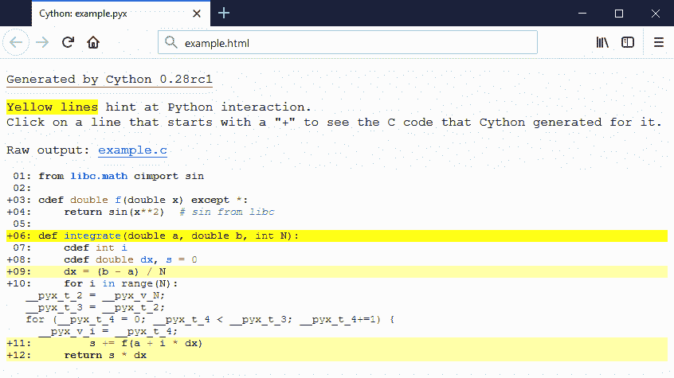

# 使用更快静态类型代码

> 原文： [http://docs.cython.org/en/latest/src/quickstart/cythonize.html](http://docs.cython.org/en/latest/src/quickstart/cythonize.html)

Cython 是一个 Python 编译器。这意味着它可以在不进行更改的情况下编译普通的 Python 代码（除了一些尚未支持的语言功能的一些明显例外，请参阅 [Cython 限制](../userguide/limitations.html#cython-limitations) ）。但是，对于影响性能的关键代码，添加静态类型声明通常很有用，因为它们将允许 Cython 脱离 Python 代码的动态特性并生成更简单，更快速的 C 代码 - 有时会快几个数量级。

但必须注意，类型声明可以使源代码更加冗长，从而降低可读性。因此，不鼓励在没有充分理由的情况下使用它们，例如基准测试证明它们在性能关键部分确实使代码更快。通常情况下，正确使用的一些类型会有很长的路要走。

所有 C 类型都可用于类型声明：整数和浮点类型，复数，结构，联合和指针类型。 Cython 可以在分配时自动和正确地转换类型。这还包括 Python 的任意大小整数类型，其中转换为 C 类型时溢出的值将在运行时引发 Python `OverflowError`。 （但是，在进行算术运算时，它不会检查溢出。）在这种情况下，生成的 C 代码将正确且安全地处理 C 类型的平台相关大小。

类型通过 cdef 关键字声明。

## 指定变量类型

考虑以下纯 Python 代码：

```py
def f(x):
    return x ** 2 - x

def integrate_f(a, b, N):
    s = 0
    dx = (b - a) / N
    for i in range(N):
        s += f(a + i * dx)
    return s * dx

```

在 Cython 中简单地编译它只能提供 35％的加速。这比没有好，但添加一些静态类型可以产生更大的差异。

使用其他类型声明，这可能如下所示：

```py
def f(double x):
    return x ** 2 - x

def integrate_f(double a, double b, int N):
    cdef int i
    cdef double s, dx
    s = 0
    dx = (b - a) / N
    for i in range(N):
        s += f(a + i * dx)
    return s * dx

```

由于迭代器变量`i`是用 C 语法定义的，因此 for 循环将被编译为纯 C 代码。键入`a`，`s`和`dx`非常重要，因为它们涉及 for 循环中的算术运算;键入`b`和`N`会产生较小的差异，但在这种情况下，要保持一致并输入整个函数并不是一件额外需要做的工作。

这导致纯 Python 版本的速度提高了 4 倍。

## 指定函数类型

Python 函数调用可能很昂贵 - 在 Cython 中是双倍的，因为可能需要转换到 Python 对象和从 Python 对象进行调用。在上面的示例中，假设参数在 `f()`内部和调用它时都是 C 中的double类型，但是`float`类型必须为参数构造一个 Python 对象才能传递它。

因此，Cython 提供了声明 C 风格函数的语法，即 cdef 关键字：

```py
cdef double f(double x) except? -2:
    return x ** 2 - x

```

通常应该添加某种形式的 except-modifier，否则 Cython 将无法传播函数（或它调用的函数）中引发的异常。 `except? -2`表示如果返回`-2`将检查错误（尽管`?`表示`-2`也可以用作有效返回值）。或者，较慢的`except *`始终是安全的。如果函数返回 Python 对象或者保证在函数调用中不会引发异常，则可以省略 except 子句。

cdef 的副作用是 Python 空间不再提供该函数，因为 Python 不知道如何调用它。也无法再在运行时更改`f()`。

使用`cpdef`关键字而不是`cdef`，还会创建一个 Python 包装器，以便该函数可以从 Cython（快速，直接传递类型值）和 Python（包装 Python 对象中的值）中获得。事实上，`cpdef`不仅提供了一个 Python 包装器，它还安装了逻辑，允许方法被 python 方法覆盖，即使从 cython 中调用也是如此。与`cdef`方法相比，这确实增加了很小的开销。

加速：超过纯 Python 的 150 倍。

## 确定所添加类型的位置

因为静态类型通常是提高速度的关键所在，所以初学者往往倾向于所见之处指定各种变量的类型。这降低了可读性和灵活性，甚至可以降低速度（例如，通过添加不必要的类型检查，转换或缓慢的缓冲区解包）。另一方面，忘记键入关键循环变量很容易破坏性能。帮助完成此任务的两个基本工具是分析和注释。分析应该是任何优化工作的第一步，并且可以告诉您在哪里花费时间。 Cython 的注释可以告诉你为什么你的代码需要时间。

使用`-a`开关到`cython`命令行程序（或跟随 Sage 笔记本的链接）会导致 Cython 代码的 HTML 报告与生成的 C 代码交错。线条根据“类型”的级别着色 - 白线转换为纯 C，而需要 Python C-API 的线条为黄色（因为它们转化为更多的 C-API 交互，因此更暗）。转换为 C 代码的行在前面有一个加号（`+`），可以单击以显示生成的代码。

当优化速度函数以及确定何时 [释放 GIL](../userguide/external_C_code.html#nogil)时，此报告非常有用：通常，`nogil`块可能只包含“白色”代码。



请注意，Cython 根据其赋值（包括作为循环变量目标）推断出局部变量的类型，这也可以减少在任何地方显式指定类型的需要。例如，将`dx`声明为 double 类型是不必要的，就像在最后一个版本中声明`s`的类型一样（其中`f`的返回类型已知为 C 语言的double类型。）一个值得注意的例外然而，算术表达式中使用的是整数类型，因为 Cython 无法确保不会发生溢出（因此在需要 Python 的 bignums 时会回退到`object`）。要允许推断 C 整数类型，请将`infer_types` [指令](../userguide/source_files_and_compilation.html#compiler-directives) 设置为`True`。对于熟悉此语言功能的读者，此指令的工作类似于 C ++中的`auto`关键字。减少输入所有内容的需求可能会有很大帮助，但也可能导致意外。特别是如果一个人不熟悉 c 类型的算术表达式。这些可以在[中找到](https://www.eskimo.com/~scs/cclass/int/sx4cb.html)[的快速概述。](https://www.eskimo.com/~scs/cclass/int/sx4cb.html)_

